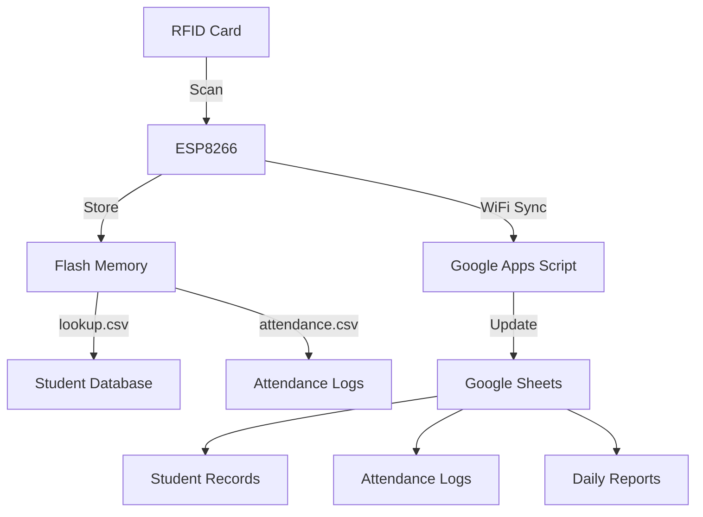

# 📋 RFID Attendance Management System

<div align="center">


**An offline-first IoT attendance system using ESP8266, RFID scanning, and cloud synchronization**

[📺 Watch Demo](https://go.screenpal.com/watch/cTl1bBnYeZ1) • [🐛 Report Bug](../../issues) • [✨ Request Feature](../../issues)

</div>

---

## 📖 Table of Contents

- [Overview](#-overview)
- [Key Features](#-key-features)
- [Hardware Components](#-hardware-components)
- [System Architecture](#-system-architecture)
- [Operating Modes](#-operating-modes)
- [Data Structure](#-data-structure)
- [Server Integration](#-server-integration)
- [Storage Design](#-storage-design)
- [Demo](#-demo)
- [Team](#-team)
- [Limitations](#-limitations)

---

## 🎯 Overview

This project is an **IoT-based attendance management system** designed to replace traditional manual attendance methods. Built as an academic prototype, it demonstrates the integration of embedded systems with cloud services while maintaining **offline-first reliability**.

### Core Philosophy

The system separates **data collection** from **data synchronization**:

| **Local (Device Side)** | **Cloud (Server Side)** |
|---|---|
| 🏷️ RFID card scanning | ☁️ Google Sheets backend |
| 💾 Local flash storage | 📊 Apps Script processing |
| 📴 Offline operation | 📈 Reports & analytics |

This design ensures attendance can be recorded even without internet connectivity, with automatic synchronization when WiFi becomes available.

---

## ✨ Key Features

<table>
<tr>
<td width="50%">

### 📴 Offline-First Design
- ✅ Works without internet
- ✅ Local flash storage
- ✅ Auto-sync when online

</td>
<td width="50%">

### 🔐 Secure & Accurate
- ✅ RFID-based verification
- ✅ RTC timestamps
- ✅ Anti-proxy measures

</td>
</tr>
<tr>
<td width="50%">

### ⚙️ Easy Configuration
- ✅ Web-based setup
- ✅ WiFi access point mode
- ✅ Simple registration

</td>
<td width="50%">

### ☁️ Cloud Integration
- ✅ Google Sheets backend
- ✅ Automatic backups
- ✅ Real-time reports

</td>
</tr>
</table>

---

## 🛠️ Hardware Components

| Component | Model | Purpose |
|-----------|-------|---------|
| **Microcontroller** | ESP8266 | Processing, WiFi, Storage |
| **RFID Reader** | MFRC522 | Card scanning |
| **RTC Module** | DS3231 | Accurate timekeeping |
| **Display** | LCD I2C | Visual feedback |
| **Input** | 2x Switches | Mode selection |

### Wiring Diagram
```
┌─────────────┐
│   ESP8266   │
├─────────────┤
│ GPIO 0  ────┼──► Switch 1 (Mode Bit 0)
│ GPIO 2  ────┼──► Switch 2 (Mode Bit 1)
│ SDA     ────┼──► LCD Display
│ SCL     ────┼──► LCD Display
│ MOSI    ────┼──► RFID (MFRC522)
│ MISO    ────┼──► RFID (MFRC522)
│ SCK     ────┼──► RFID (MFRC522)
└─────────────┘
```

---

## 🏗️ System Architecture



### Data Flow

1. **Student Registration** (Mode 0)
   - Admin scans RFID card
   - Enters name and roll number
   - Data saved to `lookup.csv`

2. **Attendance Marking** (Mode 1)
   - Student taps RFID card
   - System validates against `lookup.csv`
   - Entry logged to `attendance.csv`

3. **Cloud Synchronization** (Mode 2/3)
   - Device connects to WiFi
   - Uploads data via Google Apps Script
   - Server updates spreadsheets

---

## 🔄 Operating Modes

The system uses **2 switches** to select between **4 modes** (Finite State Machine):

<table>
<tr>
<th>Switch 1</th>
<th>Switch 2</th>
<th>Mode</th>
<th>Function</th>
</tr>
<tr>
<td align="center">0</td>
<td align="center">0</td>
<td><b>Mode 0</b></td>
<td>Configuration Mode</td>
</tr>
<tr>
<td align="center">1</td>
<td align="center">0</td>
<td><b>Mode 1</b></td>
<td>Attendance Mode</td>
</tr>
<tr>
<td align="center">0</td>
<td align="center">1</td>
<td><b>Mode 2</b></td>
<td>Daily Log Upload</td>
</tr>
<tr>
<td align="center">1</td>
<td align="center">1</td>
<td><b>Mode 3</b></td>
<td>Database Upload</td>
</tr>
</table>

### 🔧 Mode 0: Configuration Mode

**Purpose:** Register new students

**Process:**
1. ESP8266 creates WiFi hotspot: `Attendance_Setup`
2. Admin connects via phone/laptop
3. Navigate to `http://configAttendance`
4. Scan RFID card and enter details:
   - Student name
   - Roll number
5. Data saved to `lookup.csv`

**Use Case:** Initial setup or adding new students

---

### ✅ Mode 1: Attendance Mode

**Purpose:** Mark student attendance (offline)

**Process:**
1. Student taps RFID card
2. System reads card UID
3. Matches UID against `lookup.csv`
4. Records entry in `attendance.csv` with:
   - Name and roll number
   - RTC timestamp
   - Entry type (IN/OUT)

**Validation Rules:**

| Rule | Description |
|------|-------------|
| **Duplicate Prevention** | Prevents multiple taps creating duplicate entries |
| **Time Constraint** | Enforces minimum duration before OUT entry |
| **Sequence Validation** | Ensures proper IN → OUT flow |

**Example Log Entry:**
```csv
A1B2C3D4,23AB132,Nikhil,2025-12-04 09:12,IN
```

---

### ☁️ Mode 2: Daily Log Upload

**Purpose:** Sync attendance logs to cloud

**Process:**
1. Device connects to configured WiFi
2. Reads all entries from `attendance.csv`
3. Uploads to Google Sheets via Apps Script API
4. Verifies successful upload
5. Clears local logs after confirmation

**Safety Features:**
- Failed uploads are retried
- No duplicate entries
- Logs preserved until confirmed upload

---

### 📊 Mode 3: Database Upload

**Purpose:** Sync student database to cloud

**Process:**
1. Connects to WiFi
2. Uploads `lookup.csv` contents
3. Updates server-side student database
4. Server uses this as master record

**Use Case:** Initial setup or after bulk student registration

---

## 📁 Data Structure

### Attendance Log Format

Each attendance entry contains:

| Field | Description | Example |
|-------|-------------|---------|
| **UID** | RFID card unique identifier | `A1B2C3D4` |
| **Roll No.** | Student roll number | `23ABCC0102` |
| **Name** | Student name | `Nikhil` |
| **Timestamp** | Date & time from RTC | `2025-12-04 09:12` |
| **Type** | Entry type | `IN` or `OUT` |

### Sample Records

```csv
UID,Roll,Name,Timestamp,Type
A1B2C3D4,23AB164,Nikhil,2025-12-04 09:12,IN
B5C6D7E8,23EP0502,Prince,2025-12-04 09:15,IN
B5C6D7E8,23EP0502,Prince,2025-12-04 12:50,OUT
```

---

## 📊 Server Integration

### Google Sheets Structure

#### 1️⃣ **Student Database Sheet**
`Student_Attendance_Record`

| UID | Roll | Name | Total Attendance |
|-----|------|------|------------------|
| A1B2C3D4 | 23EP0502 | Nikhil | 45 |
| B5C6D7E8 | 23ML0502 | Prince | 42 |

---

#### 2️⃣ **Attendance Log Sheet**
`Attendance_Log_Records`

| Date | Time | UID | Roll | Name | Type |
|------|------|-----|------|------|------|
| 2025-12-04 | 09:12 | A1B2C3D4 | 23CL0502 | Nikhil | IN |
| 2025-12-04 | 12:45 | A1B2C3D4 | 23CL0502 | Nikhil | OUT |

---

#### 3️⃣ **Report Sheet**
Auto-generated daily summaries with:
- Attendance matrix (students × dates)
- Present/Absent status
- Attendance percentages
- Late arrival tracking

---

## 💾 Storage Design

### File Structure

```
ESP8266 Flash Memory (SPIFFS/LittleFS)
│
├── lookup.csv          # Student database
│   └── Format: UID(8B), Roll(9B), Name(20B) ≈ 41 bytes/student
│
└── attendance.csv      # Attendance logs
    └── Format: UID, Roll, Name, Timestamp, Type ≈ 60 bytes/entry
```

### Capacity

**Minimum filesystem:** 1MB

**Supports:**
- ~24,000 student records (theoretical)
- ~16,000 attendance entries (theoretical)
- Practical deployment: 100-500 students
- Several months of attendance data

### Storage Calculation

```
For 100 students:
- lookup.csv: 100 × 41 bytes = 4.1 KB
- attendance.csv (1 month, 2 entries/day/student):
  100 × 2 × 30 × 60 bytes = 360 KB
Total: ~365 KB (well within 1MB limit)
```

---

## 🎥 Demo

**Video Demonstration:** [Watch on ScreenPal](https://go.screenpal.com/watch/cTl1bBnYeZ1)

The demo showcases:
- ✅ Student registration workflow
- ✅ RFID card scanning
- ✅ Offline attendance marking
- ✅ Cloud synchronization
- ✅ Google Sheets integration

---

## 👥 Team

<table>
<tr>
<td align="center">
<a href="https://github.com/pkgit09">

<br />
<b>Prince Kumar</b>
</a>
<br />
</td>
<td align="center">
<a href="https://github.com/RajVardhan06">

<br />
<b>Raj Vardhan</b>
</a>
<br />
</td>
<td align="center">
<a href="https://github.com/Nikhil-Grandhi">

<br />
<b>Nikhil Grandhi</b>
</a>
<br />
</td>
</tr>
</table>

---

## ⚠️ Limitations

While functional as a prototype, this system has certain constraints:

| Limitation | Impact |
|------------|--------|
| **Physical RFID Cards** | Students must carry and maintain cards |
| **WiFi Dependency** | Cloud sync requires WiFi connectivity |
| **No Encryption** | Communication not encrypted (HTTP) |
| **Scale** | Designed for small-medium deployments (100-500 students) |
| **Single Device** | One reader per location |

### Future Improvements

Potential enhancements for production deployment:
- 🔐 HTTPS/SSL encryption for cloud communication
- 📱 Mobile app integration
- 🔄 Multi-device synchronization
- 📊 Advanced analytics dashboard
- 🔔 Real-time notifications
- 🌐 Web-based admin panel

---

## 📄 Project Philosophy

> **"Reliability, Simplicity, and Offline-First Design"**

Built as a **functional academic prototype** to demonstrate:
- Embedded systems programming
- IoT communication protocols
- Cloud service integration
- Real-world problem solving

---

<div align="center">


[⬆ Back to Top](#-rfid-attendance-management-system)

</div>
